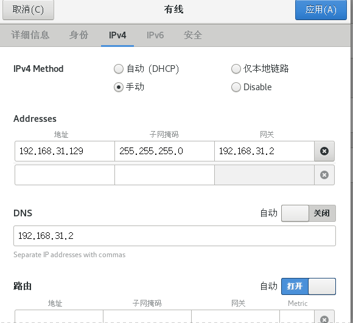

# VMware Workstation安装虚拟机

## 一、基本介绍

VMware总部位于美国加州帕洛阿尔托（Palo Alto） ，是全球云基础架构和移动商务解决方案厂商，提供基于VMware的解决方案，企业通过数据中心改造和公有云整合业务，借助企业安全转型维系客户信任 ，实现任意云端和设备上运行、管理、连接及保护任意应用 。2018财年全年收入79.2亿美元  。

VMware Workstation工作站软件包含一个用于英特尔x86相容电脑的虚拟机套装，其允许用户同时创建和运行多个x86虚拟机。

其他传统虚拟化产品：vmware station，vmware vcenter，virtualbox， win自带Hyper-v，linux自带virt-manager

## 二、下载安装

我们可以去官网：https://www.vmware.com/cn.html 下载安装包，也可以百度自行搜索；下载完后基本下一步，我就不演示了；

安装页面：


完成页面：


## 三、虚拟机镜像下载

网上很多镜像源，这里我们用阿里云的；阿里云开源镜像站：http://mirrors.aliyun.com/


https://mirrors.aliyun.com/centos/7.7.1908/isos/x86_64/CentOS-7-x86_64-DVD-1908.iso

点击下载即可


## 四、虚拟机安装

打开Vmware，文件->新建虚拟机


选择“典型”，下一步


**选择刚才下载好的镜像文件，这里是配置是D:\09--install\vm\CentOS-7-x86_64-DVD-1908.iso,然后下一步**


**设置虚拟机安装目录和虚拟名称，然后下一步**


**设置虚拟机硬盘大小，这里设置为20G，然后下一步**


**这里是一个配置向导，我们可以点击“自定义硬件”设置内存，cpu等信息，这里勾选“创建后开启此虚拟机”，点击完成即可启动**


自定义硬件设置，这里我设置内存2G，CPU2X2


**这里到了系统安装页面，等待或进入点击一下；如果屏幕分辨率有问题，可以暂停虚拟机，设置下显示器再启动；**


**加载页面等待即可**


**这里就到了系统安装配置页面，选择中文，简体中文，继续**


这里有几个地方需要配置，默认时间，键盘，语言都是不需要修改的；**软件选择和安装位置需要设置下；**


**软件选择最好选GNOME桌面，这样便于我们后续图形化配置**


**这里进来，点击完成就自动分区了，也可以选择磁盘自己设置；建议自动分区即可；**


完成后，图标就都可以了；点击开始安装；


这里记得设置ROOT密码，然后等待就可以了；


这个是设置密码页面；


看到完成页面，已大功告成；点击重启即可


## 五、服务器配置IP

这里点击未列出，输入root和刚才配置的密码


这里是基本配置，完成配置即可；


然后我们选择，系统工具-》设置-》找到最下面的网络


有线如果没打开，点击打开；然后点击右边设置按钮


默认是自动生成，详细信息可以看到ip和网关；


**如果怕ip自动会变动，我们可以设置为手动；复制刚才的IP，网关，DNS，然后子网掩码设置为255.255.255.0即可**



自此网络也配置完成了，可以远程访问了；

## 六、访问测试

打开本地cmd，ping配置的ip

```bash
>ping 192.168.31.129

正在 Ping 192.168.31.129 具有 32 字节的数据:
来自 192.168.31.129 的回复: 字节=32 时间<1ms TTL=64
来自 192.168.31.129 的回复: 字节=32 时间=1ms TTL=64
来自 192.168.31.129 的回复: 字节=32 时间=1ms TTL=64
来自 192.168.31.129 的回复: 字节=32 时间=1ms TTL=64

192.168.31.129 的 Ping 统计信息:
    数据包: 已发送 = 4，已接收 = 4，丢失 = 0 (0% 丢失)，
往返行程的估计时间(以毫秒为单位):
    最短 = 0ms，最长 = 1ms，平均 = 0ms
```

然后我们通过客户端Xshell测试，其他客户端：Putty，SecureCRT；

输入ip，账号，密码访问，这里登陆进去，虚拟机就**大工告成**了；


## 七、初始化安装的几件小事

### 1.yum数据源

这里我们切换为阿里云

```bash
# mv /etc/yum.repos.d/CentOS-Base.repo /etc/yum.repos.d/CentOS-Base.repo.backup
# curl -o /etc/yum.repos.d/CentOS-Base.repo http://mirrors.aliyun.com/repo/Centos-7.repo
#   sed -i -e '/mirrors.cloud.aliyuncs.com/d' -e '/mirrors.aliyuncs.com/d' /etc/yum.repos.d/CentOS-Base.repo
```

### 2.rzsz

 上传下载工具安装

```bash
yum install lrzsz
```

### 3.关闭防火墙

```bash
# systemctl stop firewalld.service
# systemctl disable firewalld.service 
```

### 4.关闭SELINUX

```
vi /etc/selinux/config
# 将SELINUX=enforcing改为SELINUX=disabled，如下

#SELINUX=enforcing
SELINUX=disabled
```


