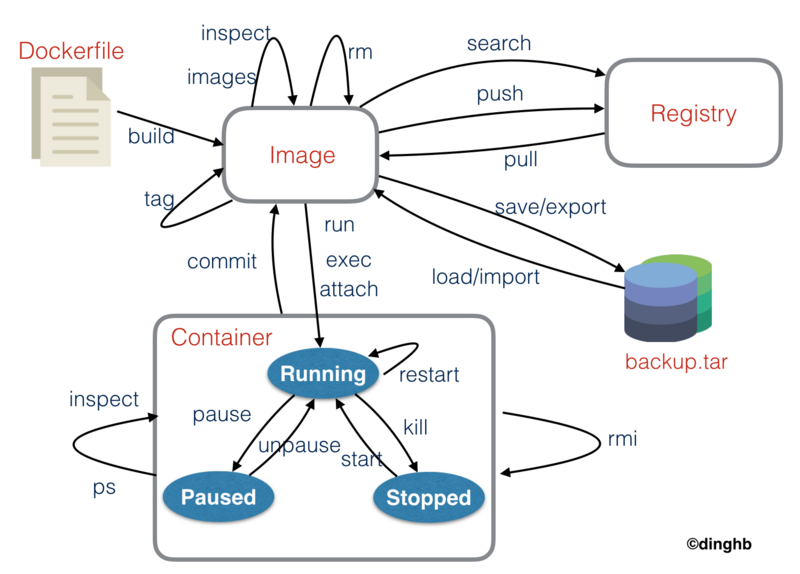

# Docker安装及容器运行

## 基本介绍

Docker 是一个开源的应用容器引擎，让开发者可以打包他们的应用以及依赖包到一个可移植的镜像中，然后发布到任何流行的 Linux或Windows 机器上，也可以实现虚拟化。容器是完全使用沙箱机制，相互之间不会有任何接口。

其他传统虚拟化产品：vmware station，vmware vcenter，virtualbox， win自带Hyper-v，linux自带virt-manager

我们可以从下面这张表格很清楚地看到容器相比于传统虚拟机的特性的优势所在：

| 特性       | 容器               | 虚拟机       |
| :--------- | :----------------- | :----------- |
| 启动       | 秒级               | 分钟级       |
| 硬盘使用   | 一般为MB           | 一般为GB     |
| 性能       | 接近原生           | 弱于         |
| 系统支持量 | 单机支持上千个容器 | 一般是几十个 |

## Docker的三个基本概念

  


从上图我们可以看到，Docker 中包括三个基本的概念：

Image(镜像)
Container(容器)
Repository(仓库)

 镜像是 `Docker` 运行容器的前提，仓库是存放镜像的场所，可见镜像更是 `Docker` 的核心。 

### Image (镜像)

那么镜像到底是什么呢？

`Docker` 镜像可以看作是一个特殊的文件系统，除了提供容器运行时所需的程序、库、资源、配置等文件外，还包含了一些为运行时准备的一些配置参数（如匿名卷、环境变量、用户等）。镜像不包含任何动态数据，其内容在构建之后也不会被改变。

### Container (容器)

容器 `(container)` 的定义和镜像 `(image)` 几乎一模一样，也是一堆层的统一视角，唯一区别在于容器的最上面那一层是可读可写的。

### Repository (仓库)

`Docker` 仓库是集中存放镜像文件的场所。镜像构建完成后，可以很容易的在当前宿主上运行，但是， 如果需要在其它服务器上使用这个镜像，我们就需要一个集中的存储、分发镜像的服务，`Docker Registry` (仓库注册服务器)就是这样的服务。有时候会把仓库 `(Repository)` 和仓库注册服务器 `(Registry)` 混为一谈，并不严格区分。`Docker` 仓库的概念跟 `Git` 类似，注册服务器可以理解为 `GitHub` 这样的托管服务。实际上，一个 `Docker Registry` 中可以包含多个仓库 `(Repository)` ，每个仓库可以包含多个标签 `(Tag)`，每个标签对应着一个镜像。所以说，镜像仓库是 `Docker` 用来集中存放镜像文件的地方类似于我们之前常用的代码仓库。

## Docker安装

### CentOS 7.6 安装 Docker

操作系统：CentOS 7.6.1810

软件源：阿里云镜像（在阿里云镜像站上面可以找到docker-ce的软件源，使用国内的源速度比较快）

安装docker-ce

如果没有物理机，可以先使用虚拟机进行学习。操作系统安装，跳过（网上教程很多）。

1、安装依赖

docker依赖于系统的一些必要的工具，可以提前安装。

yum install -y yum-utils device-mapper-persistent-data lvm2

2、添加软件源

yum-config-manager --add-repo http://mirrors.aliyun.com/docker-ce/linux/centos/docker-ce.repo

3、安装docker-ce

yum clean all 

yum makecache fast

yum -y install docker-ce

4、启动服务

通过systemctl启动服务

systemctl start docker

5、查看安装版本

这样子就安装成功了，启动服务以后可以使用docker version查看一下当前的版本。

docker version


运行效果：

```bash
[root@node opt]# yum install -y yum-utils device-mapper-persistent-data lvm2
已加载插件：fastestmirror, langpacks
Loading mirror speeds from cached hostfile
软件包 yum-utils-1.1.31-52.el7.noarch 已安装并且是最新版本
软件包 device-mapper-persistent-data-0.8.5-1.el7.x86_64 已安装并且是最新版本
正在解决依赖关系
--> 正在检查事务
……………………
更新完毕:
  lvm2.x86_64 7:2.02.185-2.el7_7.2                                                                                                    

作为依赖被升级:
  device-mapper.x86_64 7:1.02.158-2.el7_7.2                            device-mapper-event.x86_64 7:1.02.158-2.el7_7.2                
  device-mapper-event-libs.x86_64 7:1.02.158-2.el7_7.2                 device-mapper-libs.x86_64 7:1.02.158-2.el7_7.2                 
  lvm2-libs.x86_64 7:2.02.185-2.el7_7.2                               

完毕！

[root@node opt]# yum-config-manager --add-repo http://mirrors.aliyun.com/docker-ce/linux/centos/docker-ce.repo
已加载插件：fastestmirror, langpacks
adding repo from: http://mirrors.aliyun.com/docker-ce/linux/centos/docker-ce.repo
grabbing file http://mirrors.aliyun.com/docker-ce/linux/centos/docker-ce.repo to /etc/yum.repos.d/docker-ce.repo
repo saved to /etc/yum.repos.d/docker-ce.repo

[root@node opt]# yum clean all 
已加载插件：fastestmirror, langpacks
正在清理软件源： base docker-ce-stable extras updates

[root@node opt]# yum makecache fast
已加载插件：fastestmirror, langpacks
Determining fastest mirrors
…………………………
(6/6): updates/7/x86_64/primary_db                                                                             | 7.6 MB  00:00:03     
元数据缓存已建立

[root@node opt]# yum -y install docker-ce
\已加载插件：fastestmirror, langpacks
Loading mirror speeds from cached hostfile
正在解决依赖关系
--> 正在检查事务
---> 软件包 docker-ce.x86_64.3.19.03.8-3.el7 将被 安装
…………………………
已安装:
  docker-ce.x86_64 3:19.03.8-3.el7                                                                                                    

作为依赖被安装:
  container-selinux.noarch 2:2.107-3.el7       containerd.io.x86_64 0:1.2.13-3.1.el7       docker-ce-cli.x86_64 1:19.03.8-3.el7      

完毕！

[root@node opt]# systemctl start docker

[root@node opt]# docker version
Client: Docker Engine - Community
 Version:           19.03.8
 API version:       1.40
 Go version:        go1.12.17
 Git commit:        afacb8b
 Built:             Wed Mar 11 01:27:04 2020
 OS/Arch:           linux/amd64
 Experimental:      false

Server: Docker Engine - Community
 Engine:
  Version:          19.03.8
  API version:      1.40 (minimum version 1.12)
  Go version:       go1.12.17
  Git commit:       afacb8b
  Built:            Wed Mar 11 01:25:42 2020
  OS/Arch:          linux/amd64
  Experimental:     false
 containerd:
  Version:          1.2.13
  GitCommit:        7ad184331fa3e55e52b890ea95e65ba581ae3429
 runc:
  Version:          1.0.0-rc10
  GitCommit:        dc9208a3303feef5b3839f4323d9beb36df0a9dd
 docker-init:
  Version:          0.18.0
  GitCommit:        fec3683

```

### CentOS 8.0 安装 Docker

安装步骤：

1. 下载docker-ce的repo

curl https://download.docker.com/linux/centos/docker-ce.repo -o /etc/yum.repos.d/docker-ce.repo

2. 安装依赖（这是相比centos7的关键步骤）

yum install https://download.docker.com/linux/fedora/30/x86_64/stable/Packages/containerd.io-1.2.6-3.3.fc30.x86_64.rpm

3. 安装docker-ce

yum install docker-ce

4. 启动docker

systemctl start docker
到此，docker仅是安装成功，其他功能有待测试。


## Docker常用命令

我们可以通过 `docker -h` 去查看命令的详细的帮助文档。在这里我只会讲一些平常日常比赛或者生活中我们可能会用的比较多的一些命令。



示例：

```bash
[root@node ~]# docker search redis
NAME                             DESCRIPTION                                     STARS               OFFICIAL            AUTOMATED
redis                            Redis is an open source key-value store that…   7989                [OK]                
bitnami/redis                    Bitnami Redis Docker Image                      140                                     [OK]
sameersbn/redis                                                                  79                                      [OK]

[root@node ~]# docker pull redis
Using default tag: latest
latest: Pulling from library/redis
Digest: sha256:a732b1359e338a539c25346a50bf0a501120c41dc248d868e546b33e32bf4fe4
Status: Image is up to date for redis:latest
docker.io/library/redis:latest


[root@node ~]# docker images
REPOSITORY          TAG                 IMAGE ID            CREATED             SIZE
redis               latest              4cdbec704e47        4 days ago          98.2MB

[root@node opt]# docker run -itd --name redis-test -p 6379:6379 redis
Unable to find image 'redis:latest' locally
latest: Pulling from library/redis
c499e6d256d6: Pull complete 
…………………………
021fd554320f: Pull complete 
Digest: sha256:a732b1359e338a539c25346a50bf0a501120c41dc248d868e546b33e32bf4fe4
Status: Downloaded newer image for redis:latest
afee5c83b520cee84c09c9f7b94ca3f2fb5d7c9774c0b7e556e956dfa25d8253


[root@node ~]# docker ps
CONTAINER ID        IMAGE               COMMAND                  CREATED             STATUS              PORTS                    NAMES
afee5c83b520        redis               "docker-entrypoint.s…"   5 minutes ago       Up 5 minutes        0.0.0.0:6379->6379/tcp   redis-test

[root@node ~]# docker stats redis-test
CONTAINER ID        NAME                CPU %               MEM USAGE / LIMIT     MEM %               NET I/O             BLOCK I/O           PIDS
afee5c83b520        redis-test          0.20%               1.168MiB / 1.777GiB   0.06%               2.8kB / 0B          0B / 0B             4

[root@node ~]# docker exec -it redis-test /bin/bash
root@afee5c83b520:/data# ls /
bin  boot  data  dev  etc  home  lib  lib64  media  mnt  opt  proc  root  run  sbin  srv  sys  tmp  usr  var


```

## docker安装容器安装

### docker安装redis

#### 下载运行

搜索redis，查询本地镜像，运行，测试示例如下：

```bash
$ docker search  redis
NAME                             DESCRIPTION                                     STARS               OFFICIAL            AUTOMATED
redis                            Redis is an open source key-value store that…   7623                [OK]                                                       
$ docker pull redis
Using default tag: latest
latest: Pulling from library/redis
000eee12ec04: Already exists 
5cc53381c195: Pull complete 
48bb7bcb5fbf: Pull complete 
ef8a890bb1c2: Pull complete 
32ada9c6fb0d: Pull complete 
76e034b0f296: Pull complete 
Digest: sha256:1eedfc017b0cd3e232878ce38bd9328518219802a8ef37fe34f58dcf591688ef
Status: Downloaded newer image for redis:latest
docker.io/library/redis:latest

[jenkins@localhost ~]$ docker images
REPOSITORY          TAG                 IMAGE ID            CREATED             SIZE
redis               latest              dcf9ec9265e0        3 weeks ago         98.2MB

$ docker run -itd --name redis-test -p 6379:6379 redis
766df64e1a540be58fcece3a146ceecaf0307e0c754b94989af943067808c23e

$ docker exec -it redis-test /bin/bash
root@766df64e1a54:/data# redis-cli 
127.0.0.1:6379> set a 1
OK
127.0.0.1:6379> get a
"1"
127.0.0.1:6379> del a
(integer) 1
127.0.0.1:6379> get a
(nil)
127.0.0.1:6379> exit
root@766df64e1a54:/data# exit
exit
```

#### 配置文件

redis.conf

```ini
appendonly yes
```

#### 运行并挂载目录

```bash
$docker run -d --name redis-test -p 6379:6379 -v /root/redis/conf/redis.conf:/redis.conf -v /root/redis/data:/data redis:5.0.3 redis-server --appendonly yes
```

**-d** 后台运行

**-p** 端口映射到主机的端口

**-v** 将主机目录挂载到容器的目录

**redis-server --appendonly yes :** 在容器执行redis-server启动命令，并打开redis持久化配置


### docker安装mysql

####  下载运行

搜索mysql，查询本地镜像，运行，测试示例如下：

```bash
$ docker search mysql
NAME                              DESCRIPTION                                     STARS               OFFICIAL            AUTOMATED
mysql                             MySQL is a widely used, open-source relation…   8938                [OK]                
mariadb                           MariaDB is a community-developed fork of MyS…   3146                [OK]                

$ docker pull mysql:latest
latest: Pulling from library/mysql
d599a449871e: Pull complete 
f287049d3170: Pull complete 
08947732a1b0: Pull complete 
96f3056887f2: Pull complete 
871f7f65f017: Pull complete 

$ docker run -itd --name mysql-test -p 3306:3306 -e MYSQL_ROOT_PASSWORD=123456 mysql
```

参数说明：

- **-p 3306:3306** ：映射容器服务的 3306 端口到宿主机的 3306 端口，外部主机可以直接通过 **宿主机ip:3306** 访问到 MySQL 的服务。
- **MYSQL_ROOT_PASSWORD=123456**：设置 MySQL 服务 root 用户的密码。
- -v $PWD/conf:/etc/mysql/conf.d：将主机当前目录下的 conf/my.cnf 挂载到容器的 /etc/mysql/my.cnf。
- -v $PWD/logs:/logs：将主机当前目录下的 logs 目录挂载到容器的 /logs。
- -v $PWD/data:/var/lib/mysql ：将主机当前目录下的data目录挂载到容器的 /var/lib/mysql 。

#### 运行并挂载目录

docker run -itd --name mysql-test -p 3306:3306 -v $PWD/conf:/etc/mysql/conf.d -v $PWD/logs:/logs -v $PWD/data:/var/lib/mysql -e MYSQL_ROOT_PASSWORD=123456 mysql


默认配置文件 my.cnf 

```ini
# Copyright (c) 2017, Oracle and/or its affiliates. All rights reserved.
#
# This program is free software; you can redistribute it and/or modify
# it under the terms of the GNU General Public License as published by
# the Free Software Foundation; version 2 of the License.
#
# This program is distributed in the hope that it will be useful,
# but WITHOUT ANY WARRANTY; without even the implied warranty of
# MERCHANTABILITY or FITNESS FOR A PARTICULAR PURPOSE.  See the
# GNU General Public License for more details.
#
# You should have received a copy of the GNU General Public License
# along with this program; if not, write to the Free Software
# Foundation, Inc., 51 Franklin St, Fifth Floor, Boston, MA  02110-1301 USA

#
# The MySQL  Server configuration file.
#
# For explanations see
# http://dev.mysql.com/doc/mysql/en/server-system-variables.html

[mysqld]
pid-file        = /var/run/mysqld/mysqld.pid
socket          = /var/run/mysqld/mysqld.sock
datadir         = /var/lib/mysql
secure-file-priv= NULL
# Disabling symbolic-links is recommended to prevent assorted security risks
symbolic-links=0

# Custom config should go here
!includedir /etc/mysql/conf.d/

```


#### 创建远程用户

这里创建新用户admin，付给所有权限，可进行远程维护；操作如下

```sql
mysql> use mysql;
Reading table information for completion of table and column names
You can turn off this feature to get a quicker startup with -A

Database changed
# 创建admin用户
mysql> create user  'admin'@'%' identified by 'Admin123';
Query OK, 0 rows affected (0.00 sec)
# 付给所有权限
mysql> grant all on *.* to 'admin'@'%' ;
Query OK, 0 rows affected (0.01 sec)

mysql> flush privileges;
Query OK, 0 rows affected (0.00 sec)
# 修改admin认证模式及密码
mysql> ALTER USER 'admin'@'%' IDENTIFIED WITH mysql_native_password BY 'Admin123';
Query OK, 0 rows affected (0.00 sec)
# 刷新权限
mysql> flush privileges;
Query OK, 0 rows affected (0.01 sec)

# 退出使用新用户验证登录
[root@iZ2ze8diszrt8lvjh9yr86Z ~]# mysql -uadmin -p
Enter password: 
Welcome to the MySQL monitor.  Commands end with ; or \g.
Your MySQL connection id is 22
Server version: 8.0.18 MySQL Community Server - GPL

Copyright (c) 2000, 2019, Oracle and/or its affiliates. All rights reserved.

Oracle is a registered trademark of Oracle Corporation and/or its
affiliates. Other names may be trademarks of their respective
owners.

Type 'help;' or '\h' for help. Type '\c' to clear the current input statement.

mysql> use mysql
Reading table information for completion of table and column names
You can turn off this feature to get a quicker startup with -A

Database changed
# 查看用户配置
mysql> select host,user,plugin from user;
+-----------+------------------+-----------------------+
| host      | user             | plugin                |
+-----------+------------------+-----------------------+
| %         | admin            | mysql_native_password |
| localhost | mysql.infoschema | caching_sha2_password |
| localhost | mysql.session    | caching_sha2_password |
| localhost | mysql.sys        | caching_sha2_password |
| localhost | root             | caching_sha2_password |
+-----------+------------------+-----------------------+
```


## docker其他说明

### 国内加速镜像

```bash
# vim /etc/docker/daemon.json
{
  "registry-mirrors": ["https://registry.docker-cn.com"]
}

# service docker restart
```

### 普通用户使用docker

只需要将用户添加到docker组中，命令:`usermod -G docker jenkins`

